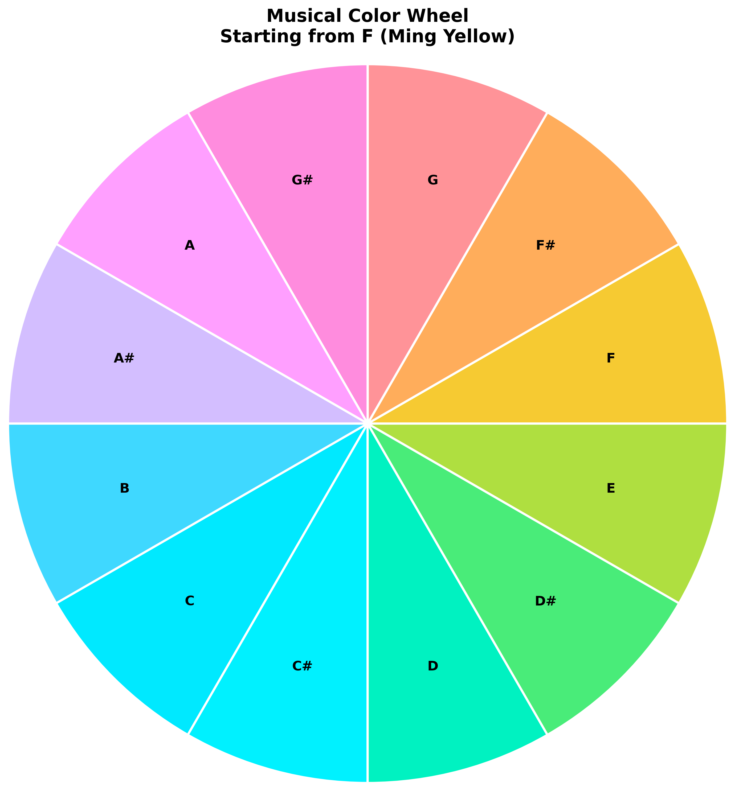

# Ideas

## Use color scale to represent musical scale

顾毓琇曾将黄钟定音为频率348Hz，很接近F4。那么我们要做的就是在色圈上找到中国的正统黄色，然后将圆周十二等分，对应于从F4开始的十二平均律音阶。经调查，中国古代皇家专用的黄色应该是“明黄”，在CIELAB色彩空间中大致对应于$L^*=77.88、a^*=6.02、b^*=74.77$。如果我们保持$L^*$值不变，在$a^*$和$b^*$组成的平面坐标系中转一圈，那就可以得到十二平均律音阶的色彩了。

结果如图（稍微调高了$L^*$亮度）：

- https://zh.wikipedia.org/wiki/%E9%A1%BE%E6%AF%93%E7%90%87#%E9%9F%B3%E6%A8%82%E5%AE%B6
- https://www.dpm.org.cn/Uploads/File/2022/05/31/u6295924e1af45.pdf

## UI layout

| Chord Progression | Music Tab | Lyrics Editor | Style Editor |
|------------------|------------|---------------|--------------|
|                | G F E D C B A |  | Instrument: Piano |
| Am                | \| \| \| \| \| \| |  When the night has come | Tempo: ♩=80 |
| ↓                | \|-\|-\|-\|-\|             | | Pattern: Arpeggio |
| C                | \| \| \| \| \| \|  | And the land is dark | Dynamics: mf |
| ↓                | \|-\|-\|-\|-\|    |         | Articulation: Legato |
| G                | \| \| \| \| \| \| |    And the moon is the only | Scale: Natural Minor |
| ↓                | \|-\|-\|-\|-\|    |         | Octave: 4 |
| F                | \| \| \| \| \| \| |   Light we'll see | Style: Ballad |

### Implementation Notes
- Tab should automatically scroll down while playing the music like Guitar Hero/Rock Band
- Place the note names of the current scale at top of the tab
- Allow real-time lyrics editing with timestamp markers
- Click to add/edit tab notes
- User can use keyboard to play/edit notes. The key `A` always corresponds to the root note, so the user can alwasy play a major scale by pressing `A S D F G H J K`, and a 12 temperament scale by pressing `A W S E D F T G Y H U J K`.
- Drag to adjust timing
- Quick chord editing by entering the chord name
- Vocal recording and pitch detection
- Scoring of pitch accuracy
- Loop section markers
